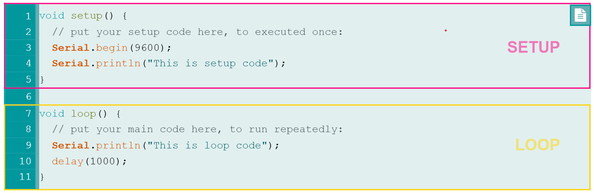

# Arduino Code Structure

Arduino code (also called Arduino sketch) includes two main parts: setup code and loop code.

## Setup Code
- code inside `setup()` function
- Executed right after power-up or reset
- Executed only one time.
- Used to initialize variables, pin modes, start using libraries.

## Loop Code
- code inside `loop()` function
- Executed right after setup code.
- Executed repeatedly (infinitely).
- Used to do the main task of application

