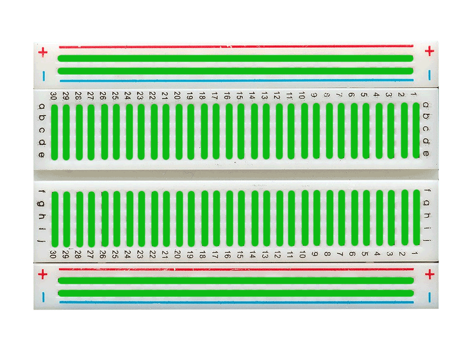
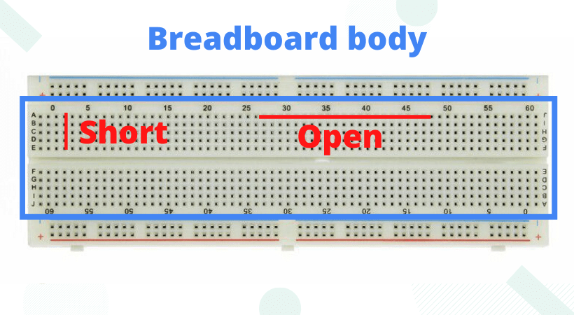

# BreadBoard

A breadboard is a reusable tool for testing and making electronic circuits without soldering. It features a grid of holes with internal conductive strips to connect components like resistors and ICs. It’s perfect for quick modifications and experimentation.

## Defination
***A breadboard is a very basic tool in electronics used to make circuit prototypes, to test our circuits, to compare the real-time results to simulation one, to build a part of a system and test it independently.***

**Breadboard is a solderless circuit making and testing device.**

---

## Breadboard parts
NOTE: There are many manufactures out there making different types of breadboard. So some breadboards may look different in size, color, or shape.
But don’t worry they do the same job and are exactly alike when it’s coming to circuit prototyping.
 
 
- The horizontal lines of holes are called rows
- The vertical lines of holes are called columns

### 1. Power Rails
The upper and below two rows of the breadboard are the power portions, called the power rail. Input power sources are attached to it and then distributed across the board by other external wires.

Further, each power rail is subdivided into two groups. In total there are four power portions. This way you can power the breadboard with different voltage sources.

Sometimes when you are working with a project, you may need different voltages at a time. This could be a problem, so to solve this issue in breadboard you have four different power portions.

Conventionally, the upper row is used for negative potential and the lower row is used for positive potential. It is a convention, you are free to do whatever the way you like it. But please be careful as powering mistakes can burn your circuit and you can harm yourself too.

### 2. The Body portion

Column wise all the dots are short (connected) and row-wise all the dots are open.

you can connect a terminal of any device in any dot in any column, this means that now the entire column is the extended version of the terminal, connecting something to this column meaning connection it to the terminal of that particular device.

Pay attention at the side of the breadboard, you see there are labels from A to E and then from F to J.  From A to E we count the number of rows is 5, and the number of columns is somewhat very large like its hard for me to count but still countable. Maybe if I counted it right it is a 5 x 60 matrix. The same goes for the other half i.e. from F to J.

### 3. Divider
Between the E and F row, there is a big gap, and it is differentiating the upper portion from the lower. It is called the divider. Between the E and F, we connect our ICs. 

Imagine if connect the IC in the upper or lower portion we will end in shorting the legs of IC and can damage it permanently.So in summary, we connect the IC between E and F, and all other components in the upper and lower portion.

## Types of Breadboards
While the fundamental concept remains the same, breadboards come in various sizes and slight variations:

- **Full-Size Breadboard:** These are the most common type, offering a good balance of space for many projects. They typically have around 830 tie points (individual connection points).

- **Half-Size Breadboard:**
Smaller than full-size, these are great for simpler circuits or when space is limited. They might have around 400 tie points.

- **Mini Breadboard:**
 Even smaller, these are perfect for tiny, focused circuits or for attaching to microcontrollers where only a few extra connections are needed.

- **Power Rail Only Breadboards:**
 Some breadboards are simply power rails, designed to be used alongside other breadboards to expand power distribution.

- **Adhesive-Backed Breadboards:** 
 Many breadboards come with an adhesive backing, allowing them to be semi-permanently attached to project enclosures or development boards.