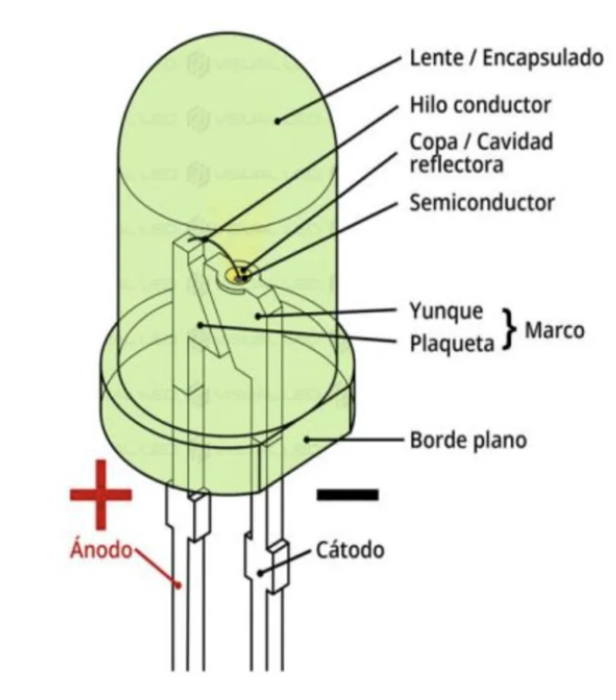
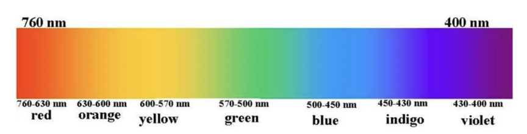

# LED

LED stands for **Light Emitting Diode**. It is a semiconductor device that emits light when electricity flows through it. Unlike traditional bulbs that use heat to create light, LEDs emit light directly from the movement of electrons.

## How LED Works
Inside an LED, there are two semiconductor layers — one with extra electrons (n-type) and one with fewer electrons (p-type). When current flows through the LED:

1. Electrons move across the junction.

2. As they move, they release energy.

3. This energy is emitted as visible light — a process called **electroluminescence**.

The color of the LED depends on the material used inside the diode.

## Components of an LED Light
- **LED Chip**: The light-emitting core.

- **Driver**: Converts AC power to low-voltage DC power.

- **Heat Sink**: Keeps the LED cool.

- **Lens or Cover**: Distributes light evenly.

These components ensure that LEDs last longer and work efficiently.

## Wavelength of the Visible Light Wavelength Chart

| LED Color | Approx. Wavelength | Inventor(s) | Year |
|----------|------------------|-------------|------|
| Infrared | ~890 nm | James R. Biard & Gary Pittman | 1961 |
| Red (Visible) | ~630–700 nm | Nick Holonyak Jr. | 1962 |
| Yellow | ~570–590 nm | M. George Craford | 1972 |
| Green (Early) | ~520–560 nm | Egon Loebner & Rubin Braunstein | 1958 |
| Blue | ~450–495 nm | Shuji Nakamura, Hiroshi Amano & Isamu Akasaki | Early 1990s |

