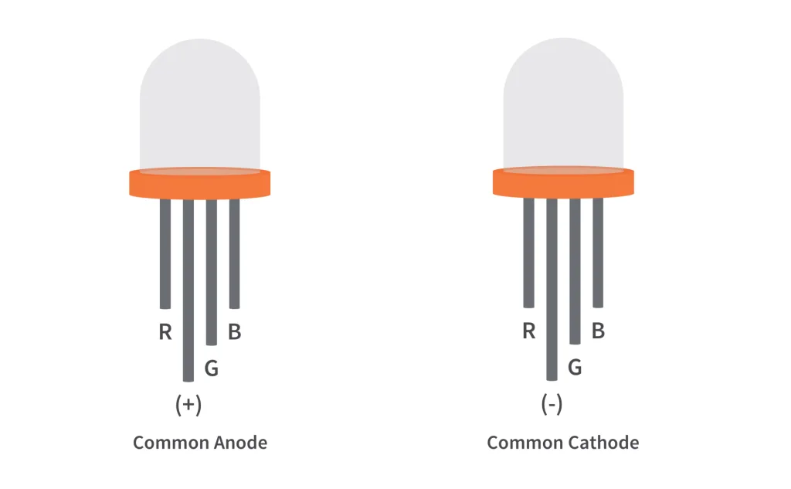
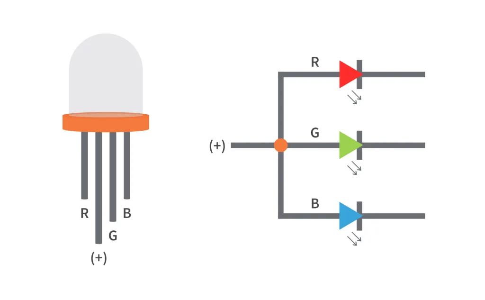
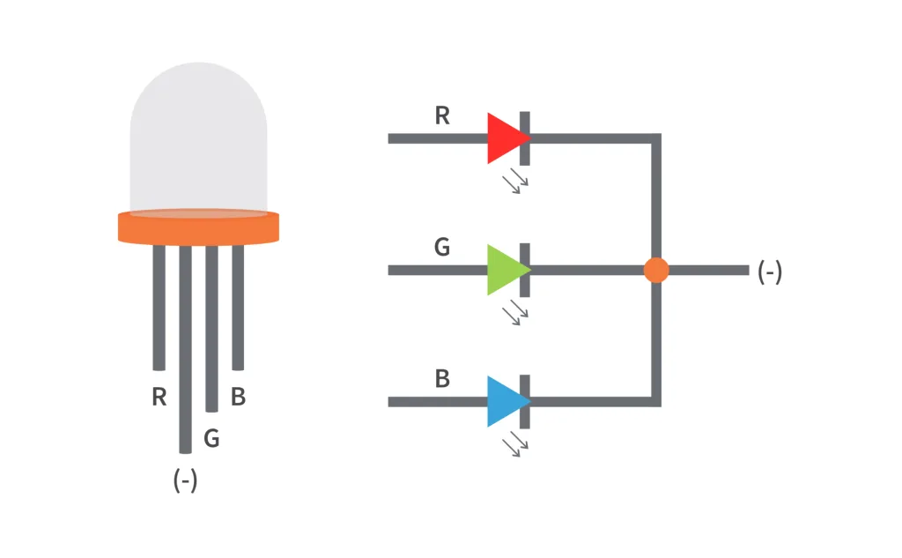

# RGB LED

An RGB LED is basically an LED package that can produce almost any color.

**RGB LEDs have three internal LEDs(RED, Green, Blue).**

In order to produce different kinds of colors, we need to set the intensity of each internal LED and combine the three color outputs. 

Here we use **PWM** to adjust the intensity of Red, Green and Blue LEDs individually and the trick here is that our eyes will see the combination of the colors, instead of the individual colors because the LEDs are very close to each other inside.

## RGB LED Types and Structure
RGB LEDs have three LEDs inside them and usually, these three internal LEDs share either a common anode or a common cathode especially in a through-hole package. 

So we can categorize RGB LEDs as either **common anode** or **common cathode** type.

When you look at an RGB LED, you'll see that it has four leads. If you face it so that its longest lead is second from the left, the leads should be in the following order: red, anode or cathode, green, and blue.

### Common Anode RGB LED

In a common anode RGB LED, the anode of the internal LEDs are all connected to the external anode lead. To control each color, you need to apply a LOW signal or ground to the red, green, and blue leads and connect the anode lead to the positive terminal of the power supply.

### Common Cathode RGB LED

In a common cathode RGB LED, the cathode of the internal LEDs are all connected to the external cathode lead. To control each color, you need to apply a HIGH signal or VCC to the red, green, and blue leads and connect the anode lead to the negative terminal of the power supply.

