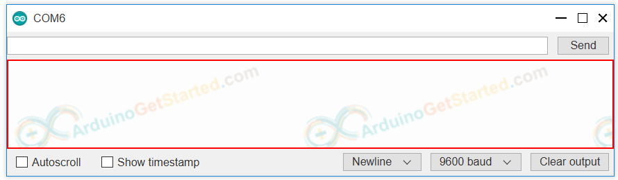
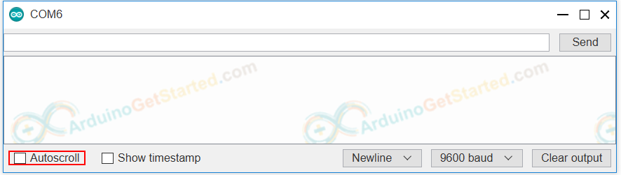
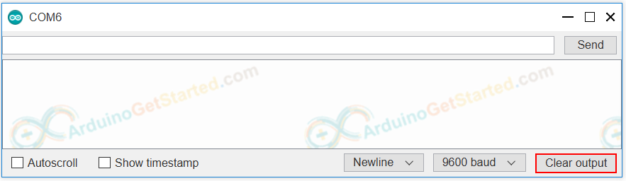
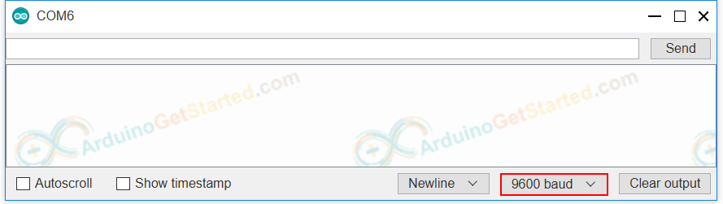
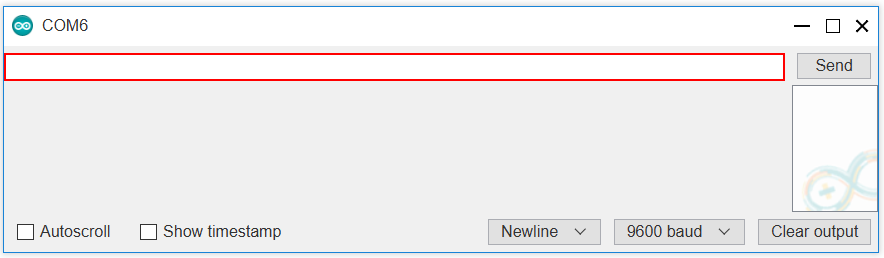
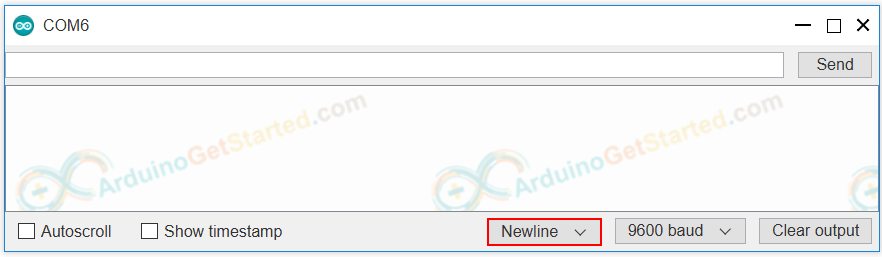

# Serial Monitor

Serial Monitor is one of the tools in Arduino IDE. It is used for two purposes:
1. **Arduino** -> PC: Receives data from Arduino and display data on screen. This is usually used for debugging and monitoring  

2. **PC** -> Arduino: Sends data (command) from PC to Arduino

Data is exchanged between Serial Monitor and Arduino via USB cable, which is also used to upload the code to Arduino. 

## Items on Serial Monitor
1. **Output console** : Display data received from Arduino.


2. **Autoscroll Checkbox** : Option to select between automatically scroll and not scroll.


3. **Show timestamp checkbox** : option to show timestamp prior to data displayed on serial Monitor.


4. **Clear output button** : clear all text on the output console.


5. **Baud rate selection** : select communication speed (baud rate) between Arduino and PC. This value must be the same as the value used in Arduino code (in `Serial.begin()`).


**NOTE** When we select baud rate(even the value is not changed), Arduino is reset. Therefore, this is one way to reset Arduino.

6. **Textbox** : user can type characters to send to Arduino


7. **Ending selection** : select the ending characters appended to data sent to Arduino.  
Selection includes:
    - No line ending: append nothing
    - Newline: append newline(`\n`) character
    - Carriage return : append carriage return (`\r`) character
    - Both `\n` and `\r` 


8. **Send button** : When the button is pressed, Serial Monitor sends data in textbox plus the ending characters to Arduino.


## Arduino To PC

To send data from Arduino to PC, we need to use the following Arduino code:

- Set baud rate and begin Serial port by using `Serial.begin()` function

```cpp
Serial.begin(baudrate);
```

- Send data to Serial Monitor using one of the following functions: `Serial.print()`, `Serial.println()`, `Serial.write()`. For example, send "Hello World!" to Serial Monitor
```cpp
Serial.println("Hello World!");
```

## PC to Arduino
You will type text on Serial Monitor and then click **Send** button.

Arduino reads data and processes it. To read data, we need to use the following Arduino code:

- Set baud rate and begin Serial port

```cpp
Serial.begin(baudrate);
```

 - Check whether data is available or not

```cpp
if (Serial.available())
{
    // TODO
}
```
- Read data from Serial port using one of the following functions:  
`Serial.read()`, `Serial.readBytes()`,  
`Serial.readBytesUntil()`, `Serial.readString()`, `Serial.readStringUntil()`

```cpp
String data = Serial.readStringUntil("\r\n");
```


