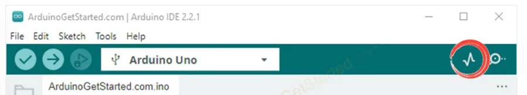
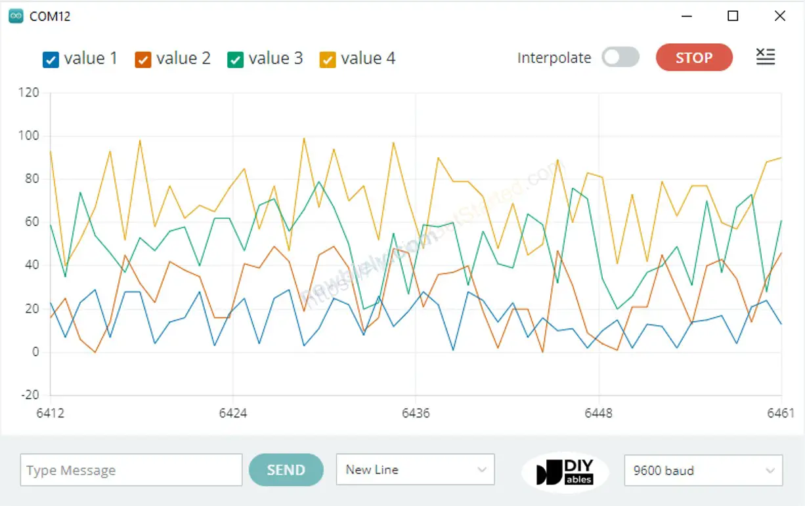
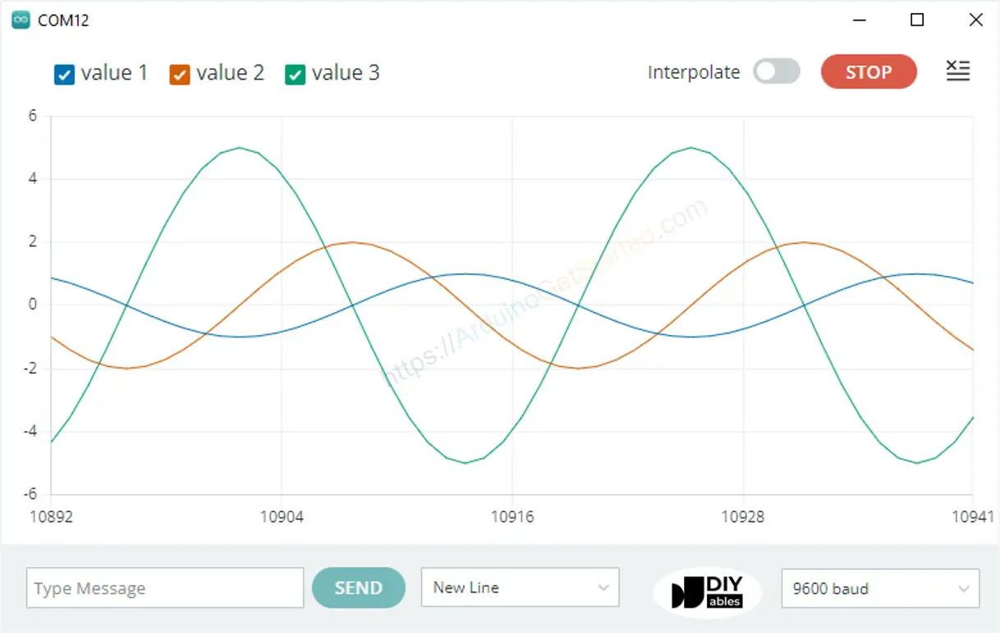

# Serail Plotter

One of the tools in Arduino IDE.  

Arduino can read the temprature, humidity or any kind of sensor data, and send it to Serial Plotter. Serial Plotter receives data from Arduino and visulaizes data as waveforms. 

Serial Plotter can not only visualize single but also multiple sensor data in the same graph.

Data is exchanged between Serial Plotter and Arduino via USB cable, which is also used to uplaod the code in Arduino . Therefore, to use Serial Plotter, we must connect Arduino and Pc via the cable.

  
  Serial plotter includes a selection box to select the serial baud rate and a graph:
  - **X - axis**: represent the time. It has 500 points. The time between each point is the time between two consecutive `Serial.println()` function calls. This time is usually equal to the time of `loop()` function.
  - **Y - axix**: represents the values received from Arduino. The Y-axis automatically adjusts itself as the value increases or decreases.


## To Open Serial Plotter



## Plottting of Single Line in Graph

To print a single graph, we just need to send the data and terminate it by `\r\n` character.  

In detail we just need to use `Serial.println()` function.(it automatiacally appends `\r\n` characters after data.) 

```c++
Serial.println(variable);
```

**Example**
```c++
void setup(){
  Serial.begin(9600);
}

void loop(){
  int y1 = analogRead(A0);
  Serial.println(y1);
  delay(1000);
}
```

## Plotting of Multiple Lines of Graph

When we want to plot multiple variables, we need to separate variables from each other by `\t` or `" "` character. The last value must be terminated by `\t\n` characters.

In detials:
- The first variable:
```c++
Serial.print(variable_first);
```

- The middle variable:
```c++
Serial.print("\t");
Serial.print(variable_nth);
```

- The last variable:
```c++
Serial.print("\t");
Serial.println(variable_last);
```

**Example**
```c++
void setup(){
  Serial.begin(9600);
}

void loop(){
  int y1 = analogRead(A0);
  int y2 = analogRead(A1);
  int y3 = analogRead(A2);
  int y4 = analogRead(A3);
  
  Serial.print(y1);
  Serial.print(" "); 
  // a space ' ' or  tab '\t' character is printed between the two values.
  
  Serial.print(y2);
  Serial.print(" "); 
  // a space ' ' or  tab '\t' character is printed between the two values.
  
  Serial.print(y3);
  Serial.print(" "); 
  // a space ' ' or  tab '\t' character is printed between the two values.
  
  // the last value is followed by a carriage return and a newline characters.
  Serail.println(y4);
  delay(100); 
}
```


## Creating 3 Sine Waveforms

```c++
void setup(){
  Serial.begin(9600);
}

void loop(){
  for(int i = 0;i < 360; i += 5){
    float y1 = 1 * sin(i * M_PI / 180);
    float y2 = 2 * sin((i + 90) * M_PI / 180);
    float y3 = 5 * sin((i + 180) * M_PI / 180);

    Serial.print(y1);
    Serial.print("\t");

    Serial.print(y2);
    Serial.print("\t");

    Serial.println(y3);

    delay(100);
  }
}
```
