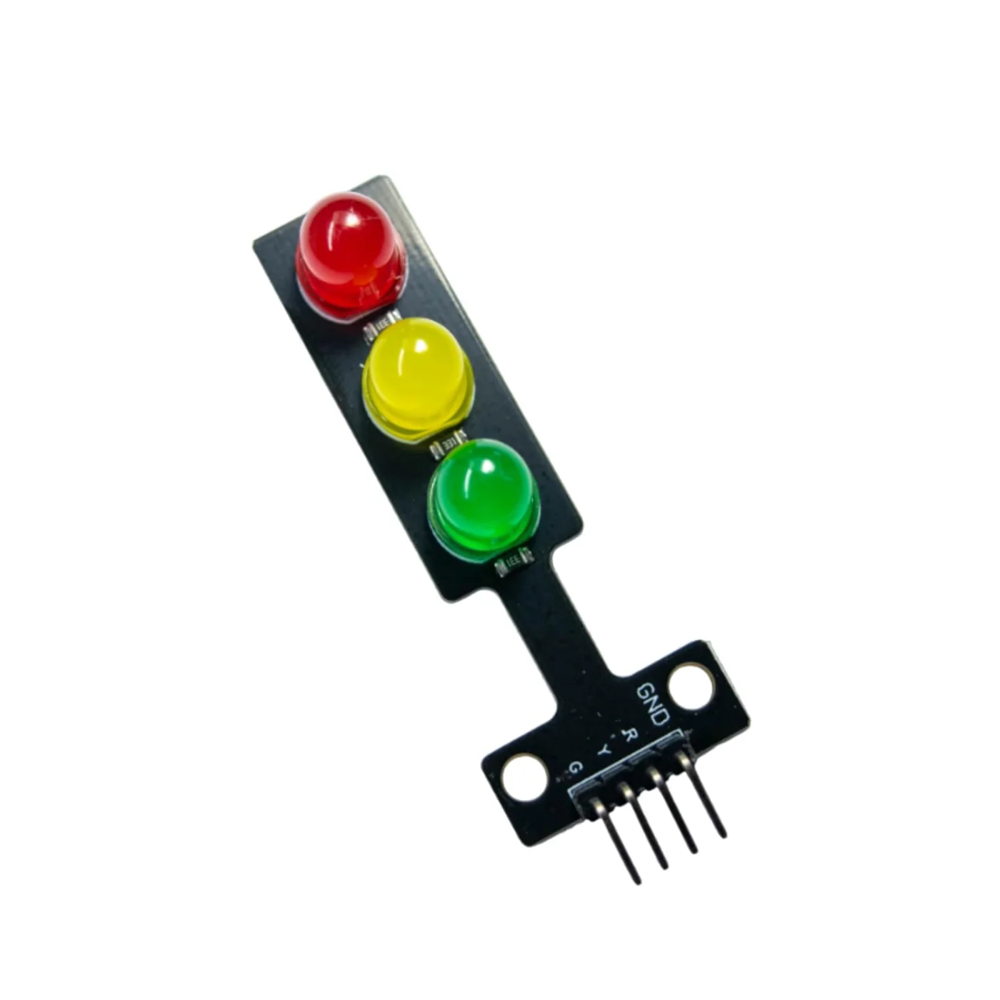

# Traffic Light Module

A Traffic Light Module is a compact electronic module that contains three LEDs (Red, Yellow/Amber, and Green) arranged vertically to simulate a real traffic signal light.

**Traffic Light Modules have three independent LEDs (RED, YELLOW, GREEN) with built-in current-limiting resistors.**


The built-in resistors (typically 220Ω or 330Ω) eliminate the need for external resistors, making wiring simpler and reducing the risk of damaging the LEDs or microcontroller pins.

## Traffic Light Module Structure

A typical traffic light module consists of:

- **Three LEDs**: Red, Yellow (Amber), and Green
- **Built-in current-limiting resistors**: One for each LED
- **Pin headers**: Usually 4 pins (Red, Yellow, Green, and GND)
- **PCB board**: Holds all components in a compact form



The module is designed to work with common microcontrollers like Arduino, Raspberry Pi, and other development boards operating at 5V or 3.3V logic levels.

## Pin Configuration

When looking at a traffic light module, you'll typically see four pins:

| Pin Label   | Function           | Connection                     |
| ----------- | ------------------ | ------------------------------ |
| R or Red    | Red LED control    | Connect to digital output pin  |
| Y or Yellow | Yellow LED control | Connect to digital output pin  |
| G or Green  | Green LED control  | Connect to digital output pin  |
| GND or -    | Common Ground      | Connect to microcontroller GND |

### Pin Layout

```
┌─────────────────┐
│   ●  RED        │ ← Red LED
│                 │
│   ●  YELLOW     │ ← Yellow LED
│                 │
│   ●  GREEN      │ ← Green LED
│                 │
└─────────────────┘
  R  Y  G  GND
  │  │  │  │
  └──┴──┴──┴────── Pin Headers
```

## Module Types

### 1. Common Cathode Traffic Light Module (Most Common)

In a common cathode configuration:

- All three LEDs share a **common negative (GND)** connection
- To turn ON an LED, apply **HIGH** (5V or 3.3V) to its respective pin
- To turn OFF an LED, apply **LOW** (0V) to its respective pin

**Control Logic:**

- `digitalWrite(pin, HIGH)` → LED ON
- `digitalWrite(pin, LOW)` → LED OFF


#### Wiring Example (Common Cathode):

```
Arduino Pin 13 ──→ R (Red)
Arduino Pin 12 ──→ Y (Yellow)
Arduino Pin 11 ──→ G (Green)
Arduino GND    ──→ GND
```

### 2. Common Anode Traffic Light Module (Less Common)

In a common anode configuration:

- All three LEDs share a **common positive (VCC)** connection
- To turn ON an LED, apply **LOW** (0V) to its respective pin
- To turn OFF an LED, apply **HIGH** (5V or 3.3V) to its respective pin

**Control Logic:**

- `digitalWrite(pin, LOW)` → LED ON
- `digitalWrite(pin, HIGH)` → LED OFF


#### Wiring Example (Common Anode):

```
Arduino Pin 13 ──→ R (Red)
Arduino Pin 12 ──→ Y (Yellow)
Arduino Pin 11 ──→ G (Green)
Arduino 5V     ──→ VCC
```

## Built-in Resistors

Traffic light modules come with **built-in current-limiting resistors** for each LED, which:

- **Protect the LEDs** from excessive current
- **Protect the microcontroller pins** from overload
- **Simplify wiring** – no need for external resistors
- Typical values: **220Ω to 330Ω** per LED

### Current Calculation

With a 5V supply and 220Ω resistor:

- Forward voltage of LED (typical): ~2V
- Voltage across resistor: 5V - 2V = 3V
- Current through LED: 3V ÷ 220Ω ≈ **13.6 mA**

This is well within the safe operating range for both standard LEDs (20mA max) and Arduino pins (40mA max per pin).

## Working Principle

Each LED in the module operates independently:

1. **Microcontroller sends HIGH signal** → Current flows through the LED → LED lights up
2. **Microcontroller sends LOW signal** → No current flows → LED turns off

By controlling the timing and sequence of these signals, you can create:

- **Traffic light sequences** (Red → Red+Yellow → Green → Yellow → Red)
- **Warning flashers** (alternating yellow)
- **Custom patterns** for indicators or animations

## Technical Specifications

| Parameter          | Typical Value      |
| ------------------ | ------------------ |
| Operating Voltage  | 3.3V - 5V          |
| Current per LED    | 10 - 20 mA         |
| LED Colors         | Red, Yellow, Green |
| Built-in Resistors | 220Ω - 330Ω        |
| Pin Spacing        | 2.54mm (0.1")      |
| Module Size        | ~45mm × 15mm       |
| Viewing Angle      | 120° - 140°        |


### Simple Traffic Light Sequence (Common Cathode)

```cpp
// Define pins
#define RED_PIN    13
#define YELLOW_PIN 12
#define GREEN_PIN  11

void setup() {
  pinMode(RED_PIN, OUTPUT);
  pinMode(YELLOW_PIN, OUTPUT);
  pinMode(GREEN_PIN, OUTPUT);
}

void loop() {
  // Red light
  digitalWrite(RED_PIN, HIGH);
  digitalWrite(YELLOW_PIN, LOW);
  digitalWrite(GREEN_PIN, LOW);
  delay(5000);  // 5 seconds

  // Red + Yellow (prepare to go)
  digitalWrite(YELLOW_PIN, HIGH);
  delay(2000);  // 2 seconds

  // Green light
  digitalWrite(RED_PIN, LOW);
  digitalWrite(YELLOW_PIN, LOW);
  digitalWrite(GREEN_PIN, HIGH);
  delay(5000);  // 5 seconds

  // Yellow light (prepare to stop)
  digitalWrite(GREEN_PIN, LOW);
  digitalWrite(YELLOW_PIN, HIGH);
  delay(2000);  // 2 seconds

  // Back to red
  digitalWrite(YELLOW_PIN, LOW);
}
```

## Comparison: Module vs Individual LEDs

| Feature           | Traffic Light Module | Individual LEDs          |
| ----------------- | -------------------- | ------------------------ |
| Wiring            | Simple (4 wires)     | Complex (6+ wires)       |
| Resistors         | Built-in             | External required        |
| Space             | Compact              | Bulkier breadboard setup |
| Cost              | Slightly higher      | Lower                    |
| Setup Time        | Fast                 | Slower                   |
| Professional Look | Yes                  | Basic                    |

## Troubleshooting

| Problem            | Possible Cause               | Solution                        |
| ------------------ | ---------------------------- | ------------------------------- |
| No LEDs light up   | GND not connected            | Check GND connection            |
| LED always ON      | Pin not configured as OUTPUT | Use `pinMode(pin, OUTPUT)`      |
| Dim light          | Voltage too low              | Use 5V supply instead of 3.3V   |
| Wrong LED lights   | Pin mismatch                 | Verify pin connections          |
| Module not working | Faulty module                | Test with multimeter or replace |

## Safety Notes

- **Do not exceed 5V** on standard modules (may damage LEDs)  
- **Do not reverse polarity** (check GND and VCC carefully)  
- **Do not connect directly to AC power** (use only DC voltage)  
- **Avoid short circuits** between pins
