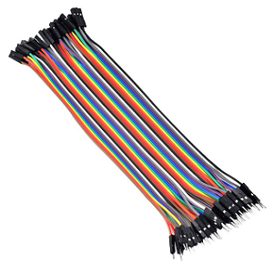
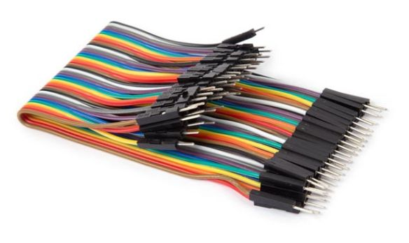

# Jumper Wires

## Defination
Jumper wires are simple, reusable wires used to make temporary electrical connections between different parts of a circuit.

Instead of soldering components together, which is permanent, these wires let you easily connect and disconnect points as needed. 

Jumper wires do not have a single inventor.
They evolved across the 1940s–1990s from patch wiring systems, solderless breadboards patented by Ronald J. Portugal in the USA in 1971, and standard Dupont-style connectors developed by DuPont and electronics manufacturers in Asia.

## Colors 
The colors of jumper wire insulation help organize and identify connections. 
These colors follow common conventions:

### Red (Vcc or Power Supply) :-
Red wires are commonly used to indicate a connection to a positive voltage source. 
This could be +5V, +3.3V, or any other designated power rail in a circuit. 

By using red for power, it becomes instantly recognizable, reducing the risk of accidentally connecting it where a ground or signal should go, an error that could damage components or cause malfunction.

### Black (GND)
Black wires are nearly universally understood to represent ground connections. Ground is the reference point in a circuit from which voltages are measured, and it's important for completing electrical loops. 

Keeping ground wires consistent and clearly marked in black helps ensure safe and accurate wiring.

### Yellow/Green/White/Blue (Signal or Control Lines)

These colors are reserved for signal paths, wires that carry data, sensor readings, or control instructions between components. 

**Yellow** often signifies analog signals or communication lines such as I2C (SCL) or SPI. 

**Green** indicates digital control or logic signals (such as Arduino digital output pins). 

White and blue can serve flexible purposes, often used where multiple signal lines need to be distinguished from each other.

**White**  used for clock signals or secondary communication lines

**Blue** may denote low-priority or auxiliary signals.

--- 
## Types of Jumper Wires
#### 1. Male to Male (M-M)
- Solid metal pins on **both ends**
- Connect **female** headers (breadboards, Arduino, etc.)
- Standard pin spacing: **2.54 mm (0.1 in)**
- Ideal for **prototyping** and **testing** without soldering
- Snug fit ensures **stable connections**
- Often available as **flat ribbon cables** for organization
- Easy to plug/unplug for quick circuit changes

#### 2. Female To Female(F-M)
- One end has a **male pin**, the other a **female socket**
- Connects **male header pins** (sensors, modules, microcontrollers) to breadboards or other circuit parts
- Male end inserts into **breadboard/development board**
- Female end grips **exposed pins** on modules/devices

#### 3. Female To Female
- **Socket connectors** on both ends
- Connect development boards (Arduino, Raspberry Pi, etc.) to components with **male pin headers**
- No soldering needed → great for **prototyping** and frequent reconfiguration
- Fits standard **2.54 mm (0.1 in)** male header pins securely

## Connector Head Types
The ends of jumper wires, which connect different parts of a circuit, can come in different shapes. These shapes are important because they affect how well the wires fit and stay in place. Here are the two most common types:

### 1. Square Heads

These have a flat, square shape. They fit snugly into breadboards (a tool used to build circuits without soldering) or pin headers (small rows of metal pins). Because they fit tightly, square heads are great for making neat, secure connections. They are useful in tight spaces or in projects that move around a lot, like robots, where wires need to stay firmly in place.

### 2. Round Heads

These ends are round and don’t fit as tightly as square ones. However, they can be easier to use in unusual or homemade setups, where the holes might not be the same size. Round heads give you more flexibility when building your circuit, especially if you’re trying something new or working with parts that aren’t standard.

also read
 [History of Jumper Wires](/Jumper_Wires/History_of_jumperwires.md)