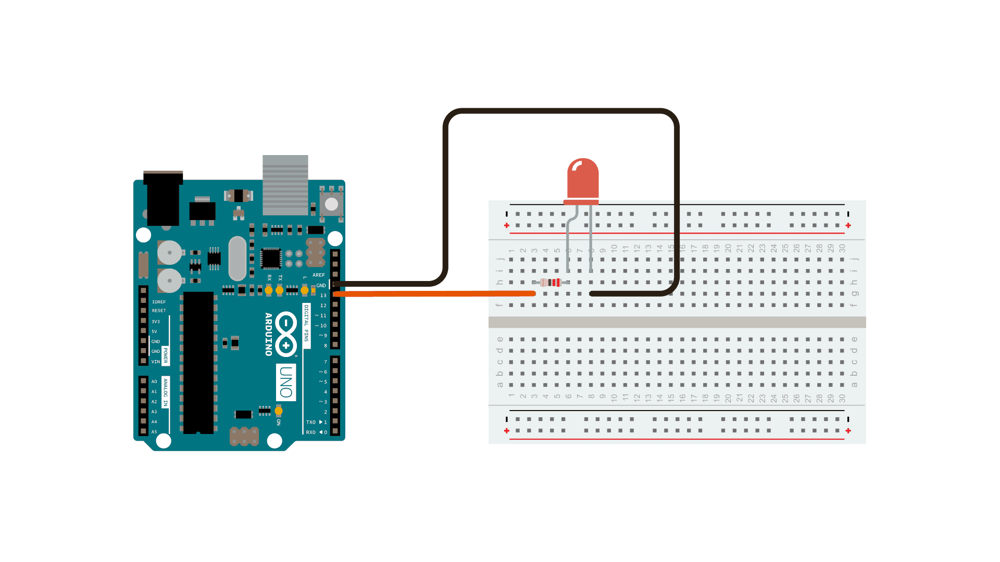

# Blink Single LED

## Hardware Required
- **Arduino Board**
- **LED**
- **220 Ω resistor**


## Circuit

This example uses the **built-in LED** that most Arduino boards have.  
The LED is connected to a digital pin, and its number may vary depending on the board type.  
To simplify usage, Arduino provides a constant called `LED_BUILTIN` in every board descriptor file.  
This constant maps to the correct digital pin for the built-in LED.

### LED_BUILTIN Pin Mapping

| Board                  | Pin  |
|-------------------------|------|
| 101                     | D13  |
| Due                     | D13  |
| Gemma                   | D1   |
| Intel Edison            | D13  |
| Intel Galileo Gen2      | D13  |
| Leonardo / Micro        | D13  |
| LilyPad                 | D13  |
| LilyPad USB             | D13  |
| MEGA2560                | D13  |
| Mini                    | D13  |
| MKR1000                 | D6   |
| Nano                    | D13  |
| Pro                     | D13  |
| Pro Mini                | D13  |
| UNO                     | D13  |
| Yún                     | D13  |
| Zero                    | D13  |

### External LED Circuit

If you want to light an **external LED** with this sketch:

1. Connect one end of the **resistor** to the digital pin corresponding to `LED_BUILTIN`.  
2. Connect the **long leg (anode)** of the LED to the other end of the resistor.  
3. Connect the **short leg (cathode)** of the LED to **GND**.  

> 💡 Example: On an Arduino UNO, `LED_BUILTIN` corresponds to **D13**.

### Why the Resistor is Important

- Limits current through the LED to prevent damage.  
- Ensures safe operation for both the LED and Arduino pin.  
- Typical calculation uses **Ohm’s Law (V = IR)**:  
  - For a 5V board (UNO R3), with LED forward voltage ≈ 2V,  
    - Resistor = (5V − 2V) / 0.013A ≈ 220 Ω.  
- You can adjust resistor values to control brightness:  
  - **220 Ω** → safe and bright.  
  - **Up to 1K Ω** → dimmer but still visible.

## Circuit Diagram



## Block Diagram


## Code
```C
void setup() {
  // initialize digital pin LED_BUILTIN as an output.
  pinMode(LED_BUILTIN, OUTPUT);
}

// the loop function runs over and over again forever
void loop() {
  digitalWrite(LED_BUILTIN, HIGH);  // turn the LED on (HIGH is the voltage level)
  delay(1000);                      // wait for a second
  digitalWrite(LED_BUILTIN, LOW);   // turn the LED off by making the voltage LOW
  delay(1000);                      // wait for a second
}
```

```pinMode(LED_BUILTIN, OUTPUT);```
- The first thing you do is to initialize LED_BUILTIN pin as an output pin with the line.

<br>

In the main loop, you turn the LED on with the line:

```digitalWrite(LED_BUILTIN, HIGH);```
- This supplies 5 volts to the LED anode. That creates a voltage difference across the pins of the LED, and lights it up. 

```digitalWrite(LED_BUILTIN, LOW);```
- Then you turn it off with the line:


That takes the LED_BUILTIN pin back to 0 volts, and turns the LED off.

```delay(1000)```
- In between the on and the off, you want enough time for a person to see the change, so the `delay()` commands tell the board to do nothing for 1000 milliseconds, or one second. When you use the `delay()` command, nothing else happens for that amount of time.

---

## Resource
### Circuit Design and Code
-  https://www.tinkercad.com/things/jsTYLGtODic-led-blink?sharecode=H463Dp8W4GkLJnDsRy-fLMcgXbbnyDRND-oC7G3zXuc

### Project Video
- https://youtube.com/shorts/6fLNgwKxu4k?feature=share

### Compoents Documentation
- [LED](../../Documentation/LED/README.md)
- Arduino UNO R3
- Resistor
- [Breadboard](../../Documentation/BreadBoard/README.md)
- [Jumper Wires](../../Documentation/Jumper_Wires/README.md)