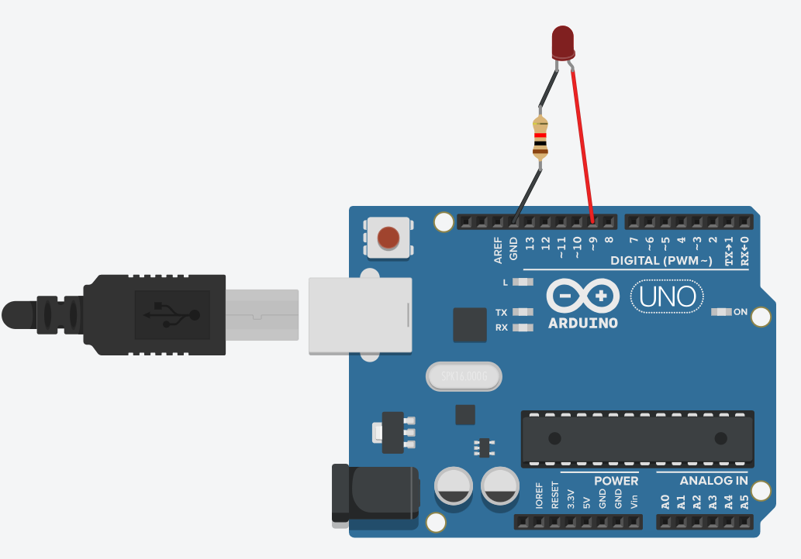
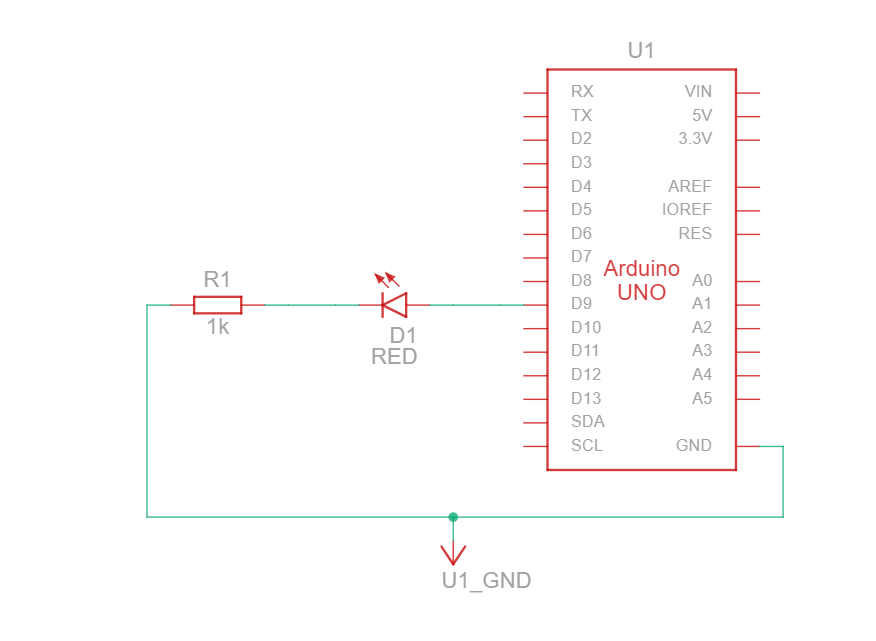

# Fade LED

## Harware Required
- **Arduino Board**
- **LED**
- **220 Ω resistor**

## Circuit

### Circuit Diagram


### Circuit Block Diagram



If generating a **PWM** signal to the anode(+), the brightness of LED is changed according to PWM value. PWM values varies from 0 to 255. The bigger PWM value is. The brighter LED is. The smaller PWM value is, the darker LED is.
- If PWM value is `0`, it is equivalent to **GND**, therefore the LED is `OFF`.
- If PWM value is `255`, it is equivalent to `VCC`, therefore, LED is fully `ON`


## Code
```C++
#define LED_PIN 9         // the Arduino PWM pin connected to the LED
#define FADE_PEDIOD 2000  // fade time is 2 seconds

unsigned long fadeStartTime;

void setup() {
  pinMode(LED_PIN, OUTPUT);
  fadeStartTime = millis();
}


void loop() {
  unsigned long progress = millis() - fadeStartTime;

  if (progress <= FADE_PEDIOD) {
    long brightness = map(progress, 0, FADE_PEDIOD, 0, 255);
    analogWrite(LED_PIN, brightness);
  } else {
    fadeStartTime = millis();  // restart fade again
  }
}
```

## Resource

### Ciruit Design and Code

- https://www.tinkercad.com/things/eGc56kRNacJ-arduino-led-fade?sharecode=iY6eIkqQoRhDCvWy6BGohm8EKcIyVUomqmvT7_M4lyc


## Compoents Documentation

- [LED](../../Documentation/LED/README.md)
- Arduino UNO R3
- Resistor
- [Breadboard](../../Documentation/BreadBoard/README.md)
- [Jumper Wires](../../Documentation/Jumper_Wires/README.md)