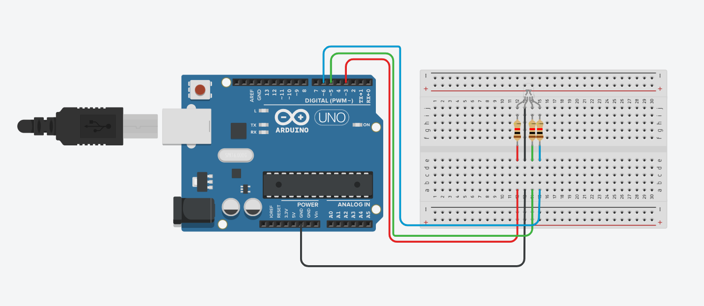
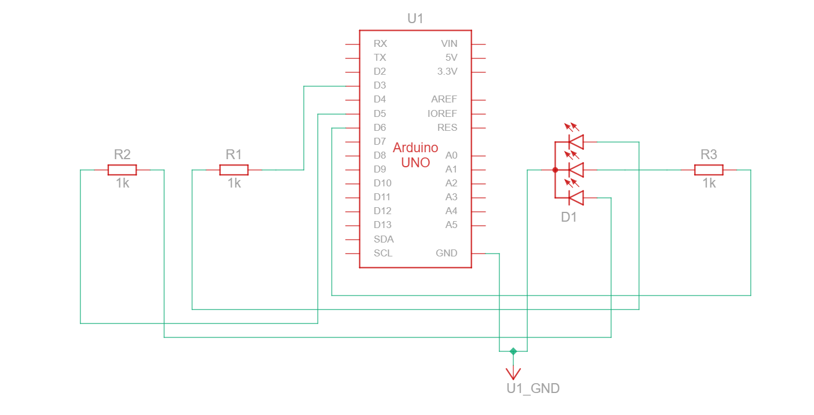

# RGB LED Blink

## Harware Required
- **Arduino Board**
- **RGB-LED**
- **3 - 220 Ω resistor**
- **BreadBoard**

## Circuit

### Circuit Diagram


### Circuit Block Diagram


By generating **PWM** signals to the Red, Green, and Blue pins of an RGB LED, we can create different colors by adjusting the brightness levels of each individual LED channel.

The **PWM values range from 0 to 255**:

- 0 → Equivalent to GND, the color channel is OFF

- 255 → Equivalent to VCC, the color channel is at maximum brightness

By mixing different intensities of Red, Green, and Blue light, we can produce a wide range of colors.

### 🎨 Color Concept

Each color is formed by combining Red, Green, & Blue light:

| PWM Value Example | Output Color | Explanation |
|------------------|--------------|-------------|
| (255, 0, 0)      | 🔴 Red       | Only Red channel ON |
| (0, 255, 0)      | 🟢 Green     | Only Green channel ON |
| (0, 0, 255)      | 🔵 Blue      | Only Blue channel ON |
| (255, 255, 0)    | 🟡 Yellow    | Red + Green mixed |
| (0, 255, 255)    | 🔹 Cyan      | Green + Blue mixed |
| (255, 0, 255)    | 🟣 Magenta   | Red + Blue mixed |
| (255, 255, 255)  | ⚪ White     | All channels ON |


## Code
```c++
#define RED_PIN 3
#define GREEN_PIN 5
#define BLUE_PIN 6

void setup(){
  pinMode(RED_PIN, OUTPUT);
  pinMode(GREEN_PIN, OUTPUT);
  pinMode(BLUE_PIN, OUTPUT);
}

void loop(){
  
  colorSet(255, 0, 0);
  colorSet(125, 125, 0);
  colorSet(0, 255, 0);
  colorSet(0, 125, 125);
  colorSet(0, 0, 255);
}

void colorSet(int red_val,int green_val,int blue_val){
  analogWrite(RED_PIN, red_val);
  analogWrite(GREEN_PIN, green_val);
  analogWrite(BLUE_PIN, blue_val);
  delay(1000);
}

```

## Resource

### Circuit Design and Code

- https://www.tinkercad.com/things/8RtX1vOcQAJ-rgb-led-blink?sharecode=D86Jho2KWX20HU8vEdzr0UNXq_nLem3OjzQAaS6fDe0

## Components Documentation
- [RGB LED](../../Documentation/RGB_LED/README.md)
- Arduino UNO R3
- Resistor
- [Breadboard](../../Documentation/BreadBoard/README.md)
- [Jumper Wires](../../Documentation/Jumper_Wires/README.md)